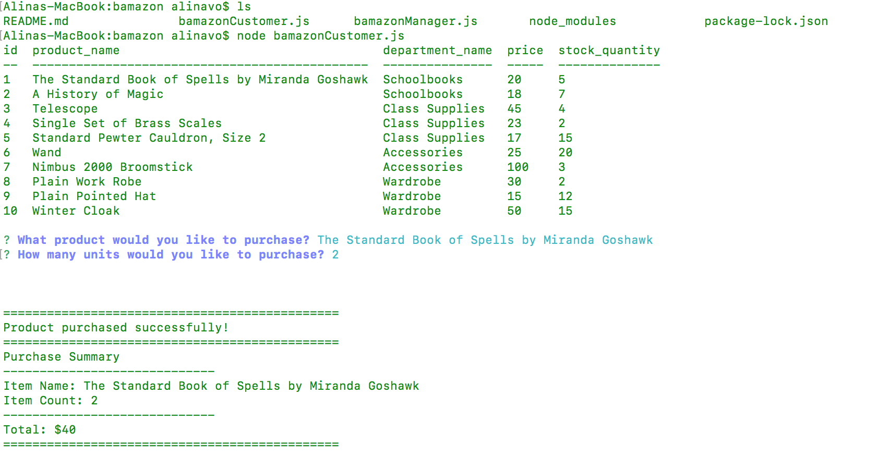

# bamazon

## Overview
Bamazon is a CLI, created with JavaScript and MYSQL. It is modeled after the Amazon-storefront allowing users to view items available in the store, make a purchase, and then deplete stock from the store's inventory. Running this application will first display all of the items in the Bamazon store available for sale. The user is then prompted to select the item they want to purchase by the up and down arrow keys or entering the ID number. Once the user selects their item for purchase, another prompt will ask the quantitiy of items they would like to purchase. If the item is not in stock, the user will receive a message that lets them know that there is an insufficient quantity in stock and the items available are displayed again. If the item is in stock, the user will see the total cost of their purchase along with an updated stock databse. This completes the transaction and the user is asked if they would like to purchase another item. 

## Setup

This application, ran in the terminal, will require [MySQL](https://www.mysql.com/) and [Node.js](https://nodejs.org/en/).

```
npm install
npm install mysql
npm install inquirer
node bamazonCustomer.js or node bamazonManager.js

```


## Customer




## Manager


## Technologies Used
* JavaScript
* Node JS
* MySQL
* NPM Packages: mysql, inquirer, console.table

